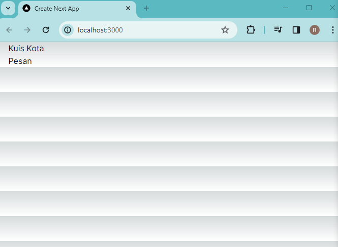

### Laporan Praktikum-4

|  | Pemrograman Berbasis Framework 2024 |
|--|--|
| NIM |  2141720166|
| Nama |  Raihan Dany Radhinnur |
| Kelas | TI - 3I |

## Prakticum - 1 
Practicum Prove
|
|

## Prakticum - 2
|
|

Answer :
    In practicum 2, what happens is that the "Order" button is added, but we can define this by importing 2 components. but need to use "{componet-name}". And we can also define the contents of the "Button-2" component in "page.tsx" but by defining the variables "Message Contents" and "Button Name" first.