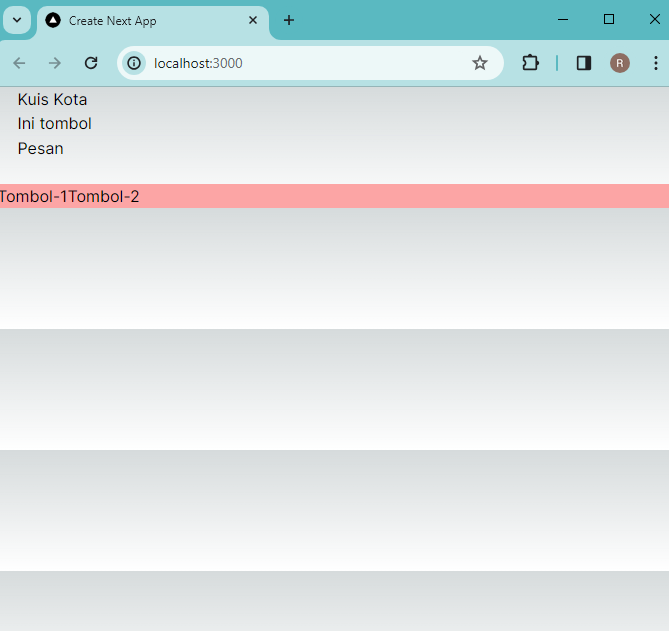

### Laporan Praktikum-4

|  | Pemrograman Berbasis Framework 2024 |
|--|--|
| NIM |  2141720166|
| Nama |  Raihan Dany Radhinnur |
| Kelas | TI - 3I |

## Practicum - 1 
Practicum Prove
|
|

## Practicum - 2
|
|

Answer :
    In practicum 2, what happens is that the "Order" button is added, but we can define this by importing 2 components. but need to use "{componet-name}". And we can also define the contents of the "Button-2" component in "page.tsx" but by defining the variables "Message Contents" and "Button Name" first.

## Practicum - 3
|
|
|

## Practicum - 4
|
|
|
|
|

Answer : The error show when we try to push button "Artikel Selanjutnya" for 5 times. After 5 page above show form 'article.tsx' in data folder. This will error will shown the image.

To solve the problem i change the code of function handleClick():
|
because the function of handleClick() is called whenever the button is clicked. The function receives an event object as its argument and the event object of this code is to move to next aritcle list but the problem it don't have the exact limit, and i think react need defined limit. 
The solved code will be like this:
|
|

## Practicum - 5
|
|
|
|
Answer : In Form_2 function the concept is inputing the firstname and the lastname to make the fullname and because of it we need to input first all of them. And in From function it have concept that it need to input the correct input so that will show 'Yay... Jawaban Benar!' 

In terms of development environment, having to recall the handler in so many places may cause the developer to forget to update/apply it, and thus will cause some bugs that will be tedious to resolve. It also requires more time and resources to compute said handler compared to using the constant variable.

